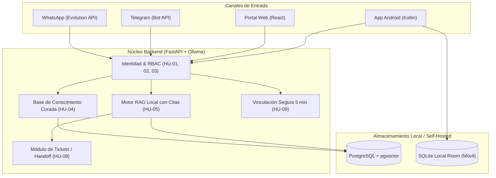

# Plan Maestro de Planificación Ágil y GitHub Projects: CampusUNSA (Secretario Jorge)

> **Asignatura:** Gestión de Proyectos de Software — Universidad Nacional de San Agustín (UNSA)  
> **Fecha de Inicio:** Miércoles, 7 de octubre de 2026  
> **Fecha de Cierre:** Lunes, 7 de diciembre de 2026  
> **Cadencia Ágil:** Sprints semanales (1 semana de duración) con revisiones/demostraciones **cada Miércoles**  
> **Repositorio Oficial:** [`MarcoXMarquez/CampusUNSA`](https://github.com/MarcoXMarquez/CampusUNSA)  
> **Tablero de Proyecto:** `CampusUNSA - Product Backlog & Board`  

---

## 1. Equipo de Desarrollo y Roles Asignados

| Integrante | Usuario GitHub | Rol Principal | Especialidad Técnica |
| :--- | :--- | :--- | :--- |
| **Marco Antonio Márquez Herrera** | `@MarcoXMarquez` | Tech Lead & Backend / IA Lead | FastAPI, Ollama (RAG), PostgreSQL / pgvector |
| **Alejandro Sebastian Alfonso Huacasi** | `@Sebastianzzzin` | Fullstack & Mensajería / DevOps Lead | Evolution API (Baileys), n8n Community, Docker |
| **Ítalo Frankdux Ccoscco Alvis** | `@iccoscco` | Frontend Web Lead & UI/UX Lead | React, Vite, Tailwind CSS, Responsive Design |
| **Chambilla Perca Ricardo Mauricio** | `@rikich3` | Mobile Developer Lead & QA Lead | Android Nativo (Kotlin), Room, Pruebas de Calidad |

---

## 2. Entendimiento del Problema, Contexto y Restricciones

### 2.1 Contexto del Negocio y Problemática
El sistema **CampusUNSA (Secretario Jorge)** resuelve la ineficiencia en la atención y orientación universitaria a los estudiantes de pregrado (piloto inicial enfocado en estudiantes de 1.° y 2.° año de la Escuela Profesional de Ingeniería de Sistemas).
- **Proceso AS-IS (Presencial actual):** 40 minutos promedio por consulta debido a desplazamientos físicos hacia secretaría, colas de espera en ventanilla y búsqueda manual de reglamentos o resoluciones.
- **Proceso TO-BE (Digital propuesto):** Reduce el tiempo promedio de atención a **2 minutos (reducción del 95%)** para consultas cubiertas, mediante:
  1. **Atención Inmediata 24/7:** Canales conversacionales en WhatsApp y Telegram conectados a un motor de conocimiento oficial verificado.
  2. **Portal Web Responsive (React):** Autogestión estudiantil y consola administrativa para que Secretaría apruebe documentos y resuelva excepciones humanas.
  3. **App Móvil (Android / Kotlin):** Consultas sincronizadas con soporte sin conexión y sesiones de concentración (temporizador de estudio y restricción opcional de apps).
  4. **Derivación Consentida (Handoff):** Si la consulta no tiene respuesta oficial o el modelo detecta incertidumbre, se genera un ticket para resolución humana por Secretaría sin inventar respuestas.

### 2.2 Restricciones Técnicas y Económicas
1. **Presupuesto Máximo de Creación:** **S/ 300.00 PEN**.  
   *Línea base presupuestada:* **S/ 287.50 PEN** (S/ 90.00 energía incremental, S/ 60.00 conectividad, S/ 100.00 insumos de respaldo/instalación y S/ 37.50 de contingencia del 15%).
2. **Costo de Mantenimiento:** Promedio fijado en **S/ 0.011 PEN por usuario activo al mes**.
3. **Arquitectura Self-Hosted (Cero Costo de Licencia / Sin Suscripciones Cloud de Pago):**
   - Inferencia IA: **Ollama** local con modelo open-weights cuantizado.
   - Base de Datos y Búsqueda Semántica: **PostgreSQL** con extensión **pgvector**.
   - Mensajería WhatsApp: **Evolution API** autoalojada con librería **Baileys**.
   - Mensajería Telegram: **Telegram Bot API** estándar gratuita.
   - Orquestación de Flujos: **n8n Community** autoalojado.
   - Backend Central: **FastAPI** (Python).
   - Frontend Web: **React** + Vite.
   - App Móvil: **Kotlin** nativo para Android (Room, Retrofit).
4. **Fronteras del Sistema:** No se alteran notas, no se realizan pagos de matrícula ni se reemplazan decisiones institucionales de Secretaría de Escuela.

---

## 3. Definición del Producto Mínimo Viable (PMV / MVP)

El PMV representa el subconjunto fundamental del sistema que valida empíricamente la hipótesis del proyecto: **resolver el 70% de las consultas frecuentes de forma autónoma con citas oficiales verificadas y canalizar el 30% restante mediante tickets**.



### Alcance del PMV (Total: 56 Story Points - Must Have):
1. **Identidad, Seguridad y Roles:**
   - Registro y verificación por correo institucional (`HU-01`, 3 PH).
   - Autenticación segura mediante JWT, renovación y cierre de sesión (`HU-02`, 5 PH).
   - Control de acceso basado en roles RBAC: Estudiante, Secretaría, Administrador TI (`HU-03`, 3 PH).
2. **Base de Conocimiento y Motor RAG:**
   - Panel para que Secretaría publique fuentes oficiales con vigencia y estado de aprobación (`HU-04`, 5 PH).
   - Inferencia con Ollama + pgvector que cita la fuente oficial o se abstiene si falta evidencia (`HU-05`, 8 PH).
3. **Canales de Mensajería:**
   - Chat interactivo por WhatsApp con tono natural y control de reintentos (`HU-06`, 8 PH).
   - Bot de Telegram con menú de comandos interactivos (`/start`, `/consultar`, etc.) (`HU-07`, 5 PH).
4. **Atención Humana y Vinculación:**
   - Derivación asistida a Secretaría con creación de ticket cuando la IA no puede responder (`HU-08`, 3 PH).
   - Vinculación cruzada de números de teléfono/Telegram a la cuenta del estudiante mediante código de 5 minutos (`HU-09`, 5 PH).
5. **Experiencia Web y Móvil:**
   - Portal Web responsive (360px+) para consultas y gestión de secretaría (`HU-10`, 3 PH).
   - App móvil Android base con consultas sincronizadas y protección offline (`HU-11`, 5 PH).
   - Temporizador de concentración de estudio (5 a 120 minutos) con guardado local de estado (`HU-12`, 3 PH).

---

## 4. Product Backlog Completo (PBI) con Estimaciones MoSCoW e INVEST

| ID | Issue | Título de la Historia / Tarea | Prioridad | PH | Sprint | Responsable Principal |
| :---: | :---: | :--- | :---: | :---: | :---: | :--- |
| **SPIKE-01** | [#1](https://github.com/MarcoXMarquez/CampusUNSA/issues/1) | Prueba de viabilidad técnica de permisos y bloqueo en Android para HU-13 | **Must** | 8h | Sprint 1 | `@rikich3` |
| **DEVOPS-01** | [#2](https://github.com/MarcoXMarquez/CampusUNSA/issues/2) | Configuración de PostgreSQL con extensión pgvector y esquemas iniciales | **Must** | 3 | Sprint 1 | `@MarcoXMarquez` |
| **DEVOPS-02** | [#3](https://github.com/MarcoXMarquez/CampusUNSA/issues/3) | Despliegue local de n8n Community y Evolution API con Baileys | **Must** | 5 | Sprint 1 | `@Sebastianzzzin` |
| **WEB-01** | [#4](https://github.com/MarcoXMarquez/CampusUNSA/issues/4) | Creación de estructura inicial del proyecto web con React, Vite y Tailwind CSS | **Must** | 2 | Sprint 1 | `@iccoscco` |
| **ARCH-01** | [#5](https://github.com/MarcoXMarquez/CampusUNSA/issues/5) | Documentación de contratos de interfaz Nivel 3 y 4 del modelo C4 | **Must** | 3 | Sprint 1 | `@MarcoXMarquez` |
| **HU-01** | [#6](https://github.com/MarcoXMarquez/CampusUNSA/issues/6) | Registro y verificación de cuenta estudiantil con correo institucional | **Must** | 3 | Sprint 2 | `@iccoscco`, `@MarcoXMarquez` |
| **HU-02** | [#7](https://github.com/MarcoXMarquez/CampusUNSA/issues/7) | Autenticación, recuperación y cierre de sesión seguro con JWT | **Must** | 5 | Sprint 2 | `@MarcoXMarquez`, `@iccoscco` |
| **HU-03** | [#8](https://github.com/MarcoXMarquez/CampusUNSA/issues/8) | Control de acceso y autorización por roles (RBAC) | **Must** | 3 | Sprint 2 | `@MarcoXMarquez`, `@Sebastianzzzin` |
| **HU-04** | [#9](https://github.com/MarcoXMarquez/CampusUNSA/issues/9) | Publicación y gestión de fuentes oficiales y base de conocimiento | **Must** | 5 | Sprint 3 | `@iccoscco`, `@Sebastianzzzin` |
| **HU-05** | [#10](https://github.com/MarcoXMarquez/CampusUNSA/issues/10) | Motor RAG local con citas oficiales y abstención ante incertidumbre | **Must** | 8 | Sprint 3 | `@MarcoXMarquez`, `@rikich3` |
| **HU-06** | [#11](https://github.com/MarcoXMarquez/CampusUNSA/issues/11) | Canal conversacional en WhatsApp con Evolution API y n8n | **Must** | 8 | Sprint 4 | `@Sebastianzzzin`, `@MarcoXMarquez` |
| **HU-07** | [#12](https://github.com/MarcoXMarquez/CampusUNSA/issues/12) | Bot de Telegram con menú de comandos interactivos y guía de escuela | **Must** | 5 | Sprint 4 | `@Sebastianzzzin` |
| **TRANS-01** | [#13](https://github.com/MarcoXMarquez/CampusUNSA/issues/13) | Pruebas de estrés y verificación de tiempo de respuesta (p95 <= 10s) | **Must** | 3 | Sprint 4 | `@rikich3` |
| **WEB-02** | [#14](https://github.com/MarcoXMarquez/CampusUNSA/issues/14) | Sección en el portal web con enlaces directos y códigos QR a bots oficiales | **Must** | 2 | Sprint 4 | `@iccoscco` |
| **HU-08** | [#15](https://github.com/MarcoXMarquez/CampusUNSA/issues/15) | Derivación consentida a Secretaría con creación de tickets (Handoff) | **Must** | 3 | Sprint 5 | `@iccoscco`, `@MarcoXMarquez`, `@Sebastianzzzin` |
| **HU-09** | [#16](https://github.com/MarcoXMarquez/CampusUNSA/issues/16) | Vinculación segura de canales con código OTP temporal de 5 minutos | **Must** | 5 | Sprint 5 | `@Sebastianzzzin`, `@MarcoXMarquez`, `@iccoscco` |
| **QA-01** | [#17](https://github.com/MarcoXMarquez/CampusUNSA/issues/17) | Pruebas de seguridad para comprobar aislamiento de datos entre estudiantes | **Must** | 3 | Sprint 5 | `@rikich3` |
| **HU-10** | [#18](https://github.com/MarcoXMarquez/CampusUNSA/issues/18) | Portal web responsive para consulta estudiantil y gestión de secretaría | **Must** | 3 | Sprint 6 | `@iccoscco` |
| **BACKEND-01** | [#19](https://github.com/MarcoXMarquez/CampusUNSA/issues/19) | Optimización de consultas SQL y paginación en tickets y documentos | **Must** | 3 | Sprint 6 | `@MarcoXMarquez` |
| **NOTIF-01** | [#20](https://github.com/MarcoXMarquez/CampusUNSA/issues/20) | Integración de notificación automática por WhatsApp/Telegram al resolver ticket | **Must** | 3 | Sprint 6 | `@Sebastianzzzin` |
| **QA-02** | [#21](https://github.com/MarcoXMarquez/CampusUNSA/issues/21) | Pruebas de compatibilidad móvil en navegadores de 360px sin scroll horizontal | **Must** | 2 | Sprint 6 | `@rikich3` |
| **HU-11** | [#22](https://github.com/MarcoXMarquez/CampusUNSA/issues/22) | Aplicación móvil Android con sincronización y protección offline | **Must** | 5 | Sprint 7 | `@rikich3` |
| **HU-12** | [#23](https://github.com/MarcoXMarquez/CampusUNSA/issues/23) | Temporizador de sesiones de concentración de estudio (5 a 120 min) | **Must** | 3 | Sprint 7 | `@rikich3` |
| **API-01** | [#24](https://github.com/MarcoXMarquez/CampusUNSA/issues/24) | Endpoint de sincronización móvil ligera para consumo eficiente de batería | **Must** | 2 | Sprint 7 | `@MarcoXMarquez` |
| **QA-03** | [#25](https://github.com/MarcoXMarquez/CampusUNSA/issues/25) | Pruebas de interrupción: reinicio del dispositivo y validación del temporizador | **Must** | 2 | Sprint 7 | `@Sebastianzzzin`, `@rikich3` |
| **HU-13** | [#26](https://github.com/MarcoXMarquez/CampusUNSA/issues/26) | Restricción consentida de apps distractoras durante el estudio | **Should** | 8 | Sprint 8 | `@rikich3` |
| **HU-14** | [#27](https://github.com/MarcoXMarquez/CampusUNSA/issues/27) | Recordatorios programados de sesiones de estudio en app móvil | **Should** | 5 | Sprint 8 | `@rikich3` |
| **PERF-01** | [#28](https://github.com/MarcoXMarquez/CampusUNSA/issues/28) | Afinamiento de concurrencia y consumo de memoria de Ollama local | **Must** | 3 | Sprint 8 | `@MarcoXMarquez` |
| **E2E-01** | [#29](https://github.com/MarcoXMarquez/CampusUNSA/issues/29) | Pruebas de integración E2E simultáneas en Web, WhatsApp, Telegram y Móvil | **Must** | 5 | Sprint 8 | `@Sebastianzzzin` |
| **UI-01** | [#30](https://github.com/MarcoXMarquez/CampusUNSA/issues/30) | Pulido final de estilos y estados de carga en el portal web | **Must** | 2 | Sprint 8 | `@iccoscco` |
| **HU-15** | [#31](https://github.com/MarcoXMarquez/CampusUNSA/issues/31) | Panel de métricas y consultas resueltas anonimizadas para Secretaría | **Could** | 3 | Posterior | `@iccoscco` |
| **HU-16** | [#32](https://github.com/MarcoXMarquez/CampusUNSA/issues/32) | Integración institucional directa para trámites sin duplicar registros | **Won't** | 13 | Posterior | `@MarcoXMarquez` |
| **PILOT-01** | [#33](https://github.com/MarcoXMarquez/CampusUNSA/issues/33) | Ejecución del piloto con 30 estudiantes voluntarios y 30 consultas reales | **Must** | 5 | Sprint 9 | `@MarcoXMarquez`, `@Sebastianzzzin`, `@iccoscco`, `@rikich3` |
| **METRICS-01** | [#34](https://github.com/MarcoXMarquez/CampusUNSA/issues/34) | Cálculo de indicadores de éxito (latencia p95, tasa de resolución >= 70%) | **Must** | 3 | Sprint 9 | `@MarcoXMarquez` |
| **COSTS-01** | [#35](https://github.com/MarcoXMarquez/CampusUNSA/issues/35) | Auditoría financiera y balance final de gastos contra presupuesto (<= S/ 300 PEN) | **Must** | 2 | Sprint 9 | `@Sebastianzzzin` |
| **DOCS-01** | [#36](https://github.com/MarcoXMarquez/CampusUNSA/issues/36) | Preparación de informe final de laboratorio, diapositivas y manuales | **Must** | 3 | Sprint 9 | `@iccoscco` |
| **RELEASE-01** | [#37](https://github.com/MarcoXMarquez/CampusUNSA/issues/37) | Generación de Release v1.0 en GitHub con tags, changelog y APK firmado | **Must** | 3 | Sprint 9 | `@rikich3` |

---

## 5. Cronograma Semanal y Gestión de Cuellos de Botella (Ruta Crítica)

El periodo abarca **9 semanas consecutivas (07 de octubre al 07 de diciembre de 2026)**. Cada Sprint inicia el miércoles y tiene su **reunión de Sprint Review y demostración formal cada Miércoles**.

```
[Semana 1] 07 Oct - 14 Oct  --> Sprint 1 (Infraestructura, C4 & Spike Móvil)
[Semana 2] 14 Oct - 21 Oct  --> Sprint 2 (Identidad, JWT & Roles RBAC)
[Semana 3] 21 Oct - 28 Oct  --> Sprint 3 (Conocimiento Oficial & RAG Ollama)
[Semana 4] 28 Oct - 04 Nov  --> Sprint 4 (Canales WhatsApp & Telegram)
[Semana 5] 04 Nov - 11 Nov  --> Sprint 5 (Vinculación OTP & Handoff Tickets)
[Semana 6] 11 Nov - 18 Nov  --> Sprint 6 (Portal Web React Estudiante/Secretaría)
[Semana 7] 18 Nov - 25 Nov  --> Sprint 7 (App Android Kotlin & Concentración)
[Semana 8] 25 Nov - 02 Dic  --> Sprint 8 (Recordatorios, Bloqueo de Apps & E2E)
[Semana 9] 02 Dic - 07 Dic  --> Sprint 9 (Piloto en Campo, Métricas p95 & Cierre)
```

### Matriz de Transferencias y Prevención de Cuellos de Botella:
1. **Infraestructura Base -> Desarrollo de Módulos (Sprint 1 a Sprint 2):**
   - Marco (`#2`) entrega PostgreSQL + pgvector e Ítalo (`#4`) entrega el scaffolding de React.
   - *Cuello de Botella Evitado:* Sin la base de datos y la estructura web, el Sprint 2 (Registro y Login) no podría iniciar.
2. **Seguridad y JWT -> Consumo Centralizado (Sprint 2 a Sprints 3-7):**
   - Marco (`#7`) entrega la autenticación JWT.
   - *Cuello de Botella Evitado:* RBAC (`#8`), Tickets (`#15`), OTP (`#16`), Portal Web (`#18`) y Móvil (`#22`) dependen de este servicio.
3. **Curación de Conocimiento -> Motor RAG (Sprint 3):**
   - Ítalo y Sebastian (`#9`) entregan la gestión de documentos oficiales. Marco y Ricardo (`#10`) despliegan el motor RAG.
   - *Cuello de Botella Evitado:* Ollama no puede indexar ni generar respuestas oficiales con citas si Secretaría no aprueba fuentes.
4. **RAG Local -> Canales de Mensajería (Sprint 3 a Sprint 4):**
   - Sebastian (`#11`, `#12`) conecta WhatsApp y Telegram al endpoint de inferencia de Marco (`#10`). Ricardo (`#13`) mide latencia p95 <= 10s.
   - *Cuello de Botella Evitado:* Si Ollama supera los 10 segundos bajo estrés, se detecta en Sprint 4 para calibrar memoria antes del piloto.
5. **Spike de Permisos Android -> Módulo de Bloqueo (Sprint 1 a Sprint 8):**
   - Ricardo (`#1`) investiga en Sprint 1 la viabilidad de `UsageStatsManager` y `LockTask` mode.
   - *Cuello de Botella Evitado:* Evita que en Sprint 8 la historia `#26` (8 PH) se bloquee por incompatibilidades del sistema operativo.
6. **E2E y Rendimiento -> Piloto en Campo (Sprint 8 a Sprint 9):**
   - Sebastian (`#29`), Marco (`#28`) e Ítalo (`#30`) validan el sistema integralmente antes de exponerlo a los 30 estudiantes en `#33`.

---

## 6. Configuración de GitHub Projects: `CampusUNSA - Product Backlog & Board`

### 6.1 Estructura de Campos
- **`Status`:** `Backlog` | `Ready for Dev` | `In Progress` | `In Review` | `Done`
- **`Priority`:** `Must Have` | `Should Have` | `Could Have` | `Won't Have`
- **`Sprint`:** Iteración semanal (`Sprint 1` hasta `Sprint 9`, `Posterior`)
- **`Start Date`:** Fecha de inicio del sprint (Miércoles)
- **`Target Date`:** Fecha de entrega del sprint (Miércoles / Hito de revisión)
- **`Estimate (PH)`:** Puntos de historia / Horas
- **`Module`:** `Backend / IA`, `Web (React)`, `Mobile (Kotlin)`, `Messaging (n8n/Evolution)`, `DevOps & Base`
- **`Assignees`:** `@MarcoXMarquez`, `@Sebastianzzzin`, `@iccoscco`, `@rikich3`

### 6.2 Las 5 Vistas Obligatorias del Tablero
1. **Pestaña `Backlog` (Vista Tabla):**
   - Agrupación: Por campo `Sprint`.
   - Orden: Por `Priority` (Must Have primero) y `Estimate (PH)` descendente.
   - Columnas: Title, Status, Priority, Estimate (PH), Assignees, Module, Sprint, Milestone.
2. **Pestaña `Priority board` (Kanban por Prioridad MoSCoW):**
   - Agrupación por columnas: `Must Have`, `Should Have`, `Could Have`, `Won't Have`.
   - Propósito: Asegurar que el equipo culmine todos los Must Have antes de iniciar tareas optativas.
3. **Pestaña `Team items` (Kanban por Integrante):**
   - Agrupación por columnas: `@MarcoXMarquez`, `@Sebastianzzzin`, `@iccoscco`, `@rikich3`.
   - Propósito: Balanceo de carga en las reuniones diarias y seguimiento de tareas individuales.
4. **Pestaña `Roadmap` (Línea de Tiempo / Gantt Ágil):**
   - Eje temporal: Del 07 de octubre al 07 de diciembre de 2026.
   - Hitos: Los 9 miércoles de demostración y entrega de cada sprint.
5. **Pestaña `My items` (Vista Personal Filtrada):**
   - Filtro: `assignee:@me is:open`.
   - Propósito: Acceso directo y sin distracciones a las tareas asignadas a cada desarrollador.
