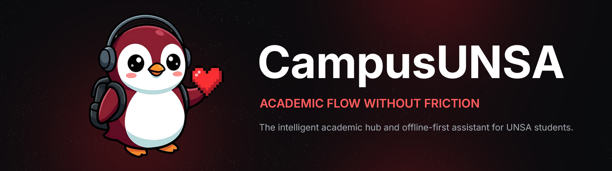
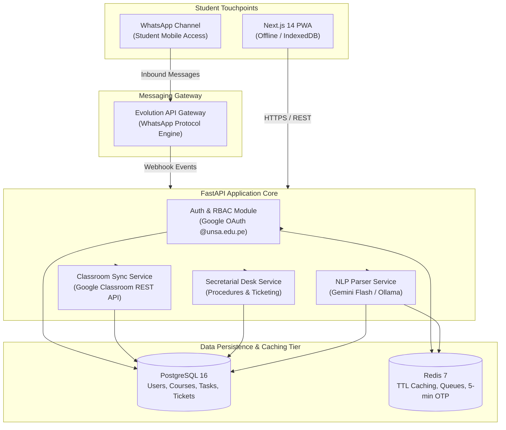

# CampusUNSA — Intelligent Academic & Administrative Hub

<p align="center">
  <picture>
    <source media="(prefers-color-scheme: light)" srcset="docs/assets/campusunsa-banner-light.png">
    
  </picture>
</p>

<p align="center">
  <a href="https://github.com/MarcoXMarquez/CampusUNSA/actions/workflows/ci.yml"></a>
  <a href="https://www.python.org/"></a>
  <a href="https://fastapi.tiangolo.com/"></a>
  <a href="https://nextjs.org/"></a>
  <a href="https://www.postgresql.org/"></a>
  <a href="https://redis.io/"></a>
  <a href="https://www.docker.com/"></a>
  <a href="https://github.com/MarcoXMarquez/CampusUNSA"></a>
  <a href="LICENSE"></a>
  <a href="https://github.com/users/MarcoXMarquez/projects/5"></a>
</p>

CampusUNSA is an offline-resilient academic operating hub engineered for the 25,000+ students and faculty members of Universidad Nacional de San Agustin de Arequipa (UNSA). It unifies fragmented academic workflows across three physical campuses (Ingenierias, Biomedicas, Sociales) into two synchronized channels: an offline-first Next.js 14 Progressive Web Application (PWA) and an automated conversational WhatsApp assistant orchestrated via FastAPI and Evolution API.

**Sovereign, lightweight, and zero-friction.** State, schedules, and credentials remain within university-governed containers. Single Sign-On is strictly anchored to institutional `@unsa.edu.pe` Google Workspace accounts with automated domain rejection. Students inspect countdown schedules, task urgency boards, and faculty paperwork procedures from any mobile viewport (>= 360px) or direct messaging chat without proprietary app store friction or third-party messaging subscription costs.

[Documentation](docs/) · [Requirements (SRS)](docs/requirements/software-requirements-specification.md) · [System Architecture (SAD)](docs/architecture/system-architecture.md) · [Agile Sprint Plan](docs/planning/agile-sprint-plan.md) · [Project Board](https://github.com/users/MarcoXMarquez/projects/5) · [Contributing](CONTRIBUTING.md) · [License](LICENSE)

---

## Quick Start

The containerized stack runs identically across macOS, Linux, and Windows using Docker Compose.

### macOS / Linux / WSL2

```bash
# Clone repository and enter directory
git clone https://github.com/MarcoXMarquez/CampusUNSA.git
cd CampusUNSA

# Create environment configuration
cp .env.example .env

# Bootstrap all microservices in background
docker compose up -d

# Verify runtime health of all containers
docker compose ps
```

### Windows (PowerShell)

```powershell
# Clone repository and enter directory
git clone https://github.com/MarcoXMarquez/CampusUNSA.git
cd CampusUNSA

# Create environment configuration
Copy-Item .env.example .env

# Bootstrap all microservices in background
docker compose up -d

# Verify runtime health of all containers
docker compose ps
```

### Local Endpoint Directory

| Service | Runtime Target | Port | Access URL |
| :--- | :--- | :---: | :--- |
| **Frontend PWA** | Next.js 14 (Node 18) | `3000` | `http://localhost:3000` |
| **Backend Core** | FastAPI (Python 3.11) | `9000` (internal 8000) | `http://localhost:9000/docs` |
| **Evolution API** | Node.js Gateway | `9080` (internal 8080) | `http://localhost:9080` |
| **Relational Database** | PostgreSQL 16 | `5432` | `localhost:5432` |
| **In-Memory Cache & OTP**| Redis 7 | `6379` | `localhost:6379` |

---

## How It Fits Together



- **The Frontend PWA** is the primary visual client: built with Next.js 14 App Router and Tailwind CSS, caching critical academic data in IndexedDB for sub-500ms offline access.
- **The Backend Core** is the async control plane: built with FastAPI and SQLAlchemy 2.0, providing strict Pydantic schemas, JWT authentication, and automatic OpenAPI documentation.
- **The Messaging Gateway** bridges WhatsApp interactions: self-hosted Evolution API connects student phone numbers to backend NLP services via secure webhooks.
- **The Persistence & Caching Tier** enforces ACID integrity and speed: PostgreSQL 16 stores relational academic state while Redis 7 manages rate limits and 5-minute OTP phone verification lifecycles.

---

## Core Capabilities

1. **Institutional Single Sign-On (Google OAuth):** Restricts access exclusively to verified `@unsa.edu.pe` institutional accounts with strict domain-level rejection.
2. **Google Classroom Sync Engine:** Automated background ingestion of enrolled courses, announcements, and assignments into a unified database.
3. **Urgency-Coded Academic Task Board:** Real-time visual kanban board categorizing deadlines: Red (<24h), Yellow (24h-72h), and Green (>72h).
4. **Dynamic Schedule & "Next Class" Countdown:** Algorithmic widget displaying physical classroom codes and campus pavilions for upcoming classes.
5. **100% Offline Operational Mode (PWA):** Seamless dashboard operation inside shielded campus buildings without cellular coverage via Workbox Service Workers and IndexedDB.
6. **WhatsApp Conversational Assistant:** Self-hosted NLP engine parsing natural language messages into structured tasks backed by 5-minute OTP phone pairing.
7. **Administrative Bureaucracy Guide & Secretarial Handoff:** Interactive flowchart navigation for academic procedures with escalation to faculty secretarial queues.

---

## Security & Privacy

- **Domain Isolation:** OAuth flow rejects any email domain outside `@unsa.edu.pe`.
- **Role-Based Access Control (RBAC):** Distinct permission sets for Students, Faculty Secretaries, and System Administrators.
- **OTP Pairing Lifecycle:** WhatsApp phone numbers pair using random 6-digit codes stored with a strict 300-second Redis TTL.
- **Confidentiality:** Zero third-party telemetry, self-hosted messaging infrastructure, and encrypted credentials in `.env`.

---

## Documentation

| Goal | Start here |
| :--- | :--- |
| Functional & non-functional requirements | [Software Requirements Specification (SRS v1.0)](docs/requirements/software-requirements-specification.md) |
| System architecture, C4 views, and data models | [System Architecture Document (SAD v1.0)](docs/architecture/system-architecture.md) |
| Agile roadmap, sprint workload, and velocity | [Agile Sprint Plan](docs/planning/agile-sprint-plan.md) · [GitHub Project Board](https://github.com/users/MarcoXMarquez/projects/5) |
| Containerized environment setup | [Quick Start](#quick-start) · [docker-compose.yml](docker-compose.yml) |
| Testing strategy, TDD, and test execution | [Development & Testing](#development--testing) |
| Contribution workflow & Definition of Done | [CONTRIBUTING.md](CONTRIBUTING.md) |

---

## Development & Testing

### Running Tests Locally

```bash
# Execute backend Pytest suite with test coverage
docker compose exec backend python -m pytest tests/ -v --cov=app --cov-report=term-missing

# Execute frontend Vitest component suite
docker compose exec frontend npm run test

# Run backend code formatting and lint verification
docker compose exec backend ruff check app tests
```

### Database Migrations (Alembic)

```bash
# Generate migration after modifying SQLAlchemy models
docker compose exec backend alembic revision --autogenerate -m "describe_migration"

# Apply pending database migrations
docker compose exec backend alembic upgrade head
```

---

## Governance & Agile Cadence

CampusUNSA is developed under an Agile Scrum methodology across 9 one-week sprints concluding in December 2026. Peer reviews, sprint milestones, and release gates are audited every Wednesday at 18:00 UTC-5.

| Sprint | Timeline | Focus Area | Deliverable Milestone |
| :---: | :---: | :--- | :--- |
| **Sprint 1** | Oct 07 - Oct 14 | Architecture Foundation & DevOps | Docker Compose stack, FastAPI + Next.js base, test runners, CI pipeline. |
| **Sprint 2** | Oct 14 - Oct 21 | Identity, Auth & Access Control | Google OAuth `@unsa.edu.pe`, profile schemas, JWT security & RBAC gates. |
| **Sprint 3** | Oct 21 - Oct 28 | Academic Ingestion (Classroom) | Classroom API connector, course and coursework sync engine, background worker. |
| **Sprint 4** | Oct 28 - Nov 04 | Academic Hub & PWA Offline | Urgency task board, dynamic schedule, "Next Class" widget, offline Service Worker. |
| **Sprint 5** | Nov 04 - Nov 11 | Messaging Gateway & OTP Auth | Evolution API webhook, Redis-backed 5-minute OTP phone pairing lifecycle. |
| **Sprint 6** | Nov 11 - Nov 18 | NLP Task Parser & Scheduling | TDD-driven LLM parser for informal text, automated task creation in database. |
| **Sprint 7** | Nov 18 - Nov 25 | Student Guidance & Secretary Desk | Interactive procedure flowcharts, secretarial handoff and ticket console. |
| **Sprint 8** | Nov 25 - Dec 02 | Candidate Extensions & Load Tests | Regulations RAG query engine / Lost & Found board, Locust load testing (1,000 users). |
| **Sprint 9** | Dec 02 - Dec 09 | System Hardening & Release v1.0 | Closed pilot with 30 UNSA students, test coverage audit, production release v1.0. |

---

## Contributors

Developed with dedication by the CampusUNSA engineering team:

<p align="center">
  <a href="https://github.com/MarcoXMarquez">
    
  </a>
  <a href="https://github.com/rikich3">
    
  </a>
  <a href="https://github.com/Sebastianzzzin">
    
  </a>
  <a href="https://github.com/iccoscco">
    
  </a>
</p>

| Engineer | GitHub Handle | Primary Role & Ownership |
| :--- | :--- | :--- |
| **Marco Antonio Marquez Herrera** | [`@MarcoXMarquez`](https://github.com/MarcoXMarquez) | Tech Lead, Software Architecture & Backend Core |
| **Ricardo Mauricio Chambilla Perca** | [`@rikich3`](https://github.com/rikich3) | Backend Services, NLP Inference & Quality Assurance Lead |
| **Alejandro Sebastian Alfonso Huacasi** | [`@Sebastianzzzin`](https://github.com/Sebastianzzzin) | Fullstack Web & DevOps Lead |
| **Italo Frankdux Ccoscco Alvis** | [`@iccoscco`](https://github.com/iccoscco) | Frontend Web & UX / Testing Lead |

---

## License

This project is licensed under the [MIT License](LICENSE) © 2026 CampusUNSA Contributors.
