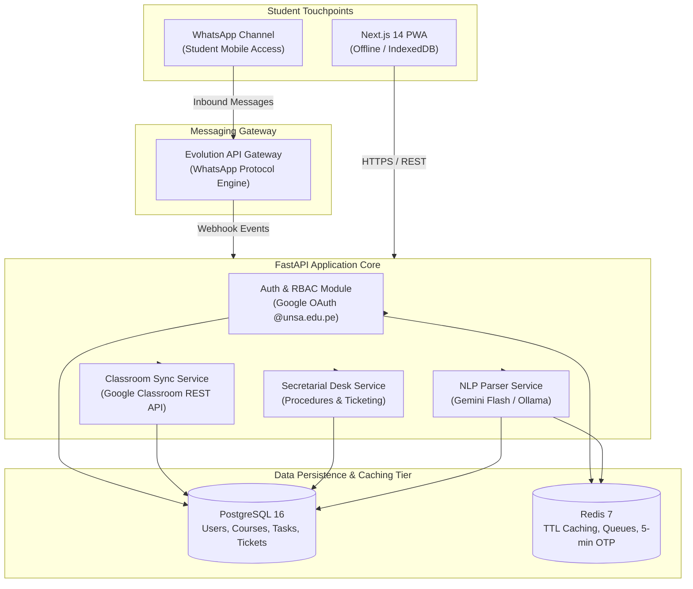

# CampusUNSA: Progressive Web Application & Academic Hub

> Official Engineering Repository for CampusUNSA  
> Universidad Nacional de San Agustín de Arequipa (UNSA) — School of Systems Engineering  
> Academic Course: Software Project Management | Delivery Cycle: October - December 2026

---

## 1. System Overview & Problem Statement

Universidad Nacional de San Agustín (UNSA) accommodates over 25,000 undergraduate and graduate students across three geographically dispersed areas:
* **Campus Ingenierías** (Av. Paucarpata)
* **Campus Biomédicas** (Av. Alcides Carrión)
* **Campus Sociales** (Av. Venezuela)

Students face critical academic friction:
1. **Academic Dispersion:** Coursework, announcements, and assignments are fragmented between Google Classroom, informal messaging groups, institutional email, and legacy SISUNSA portals. Students miss critical submission deadlines and lack a unified timetable indicating their next physical classroom.
2. **Administrative Bureaucracy & Queuing:** University procedures (enrollment rectification, course withdrawal, fee waivers) require navigating complex multi-step paperwork with zero real-time guidance, resulting in long counter queues at faculty secretarial offices.

**CampusUNSA** solves these challenges as a unified, offline-resilient Progressive Web Application (PWA) coupled with an intelligent conversational WhatsApp assistant.

---

## 2. Core Capabilities & Architecture



### Core Product Capabilities (Release v1.0)
1. **Institutional Single Sign-On (Google OAuth):** Restricts access exclusively to verified `@unsa.edu.pe` institutional accounts with strict domain-level rejection of external emails.
2. **Google Classroom Sync Engine:** Automated background ingestion of enrolled courses and pending assignments directly into a unified student database.
3. **Urgency-Coded Academic Task Board:** Real-time visual kanban/list board color-coding submissions: Red (<24h), Yellow (24h-72h), and Green (>72h).
4. **Dynamic Schedule & "Next Class" Widget:** Algorithmic countdown engine displaying physical room codes and pavilions for the student's next scheduled class.
5. **100% Offline Operational Mode (PWA):** Sub-500ms dashboard access inside campus buildings without cellular coverage via Service Worker caching and IndexedDB persistence.
6. **WhatsApp NLP Conversational Assistant:** Self-hosted Evolution API integration parsing informal notes (e.g., *"remind me to submit compilers lab this Friday at 6pm"*) into structured tasks using LLM parsing, backed by 5-minute OTP phone pairing.
7. **Administrative Bureaucracy Guide & Secretarial Handoff:** Interactive flowchart navigation for academic procedures and formal ticket escalation for faculty secretaries.

---

## 3. Technology Stack

| Layer | Technologies & Frameworks | Rationale & Selection Criteria |
| :--- | :--- | :--- |
| **Frontend PWA** | Next.js 14 (App Router), React 18, Tailwind CSS, Workbox / `next-pwa` | Mobile-first responsiveness (>= 360px), zero app-store download friction, offline caching. |
| **Backend Core** | FastAPI (Python 3.11), SQLAlchemy 2.0, Pydantic v2 | High-throughput asynchronous performance, strict schema validation, automated OpenAPI docs. |
| **NLP Inference** | Gemini Flash / Ollama (Structured JSON output) | Zero-cost local inference with fallback to high-speed cloud parsing for informal Spanish syntax. |
| **Messaging Gateway** | Evolution API (Baileys engine) | Self-hosted WhatsApp protocol gateway eliminating Meta Cloud API per-conversation messaging costs. |
| **Persistence & Cache** | PostgreSQL 16, Redis 7 | ACID transactional guarantees for academic tasks, sub-millisecond Redis TTL for 5-minute OTP lifecycle. |
| **Orchestration & CI** | Docker Compose, GitHub Actions | Identical containerized runtime across development, testing, and production environments. |

---

## 4. Engineering Standards & Quality Assurance

* **Hybrid Pragmatic Testing Strategy:**
  * **Selective TDD (Pytest):** Test-First (Red-Green-Refactor) development for core domain logic: NLP parsing fixtures, 5-minute OTP expiration lifecycles, RBAC authorization guards, and schedule calculation algorithms.
  * **Behavior-Driven Development (BDD):** Acceptance criteria specified in formal Gherkin (`Given-When-Then`) syntax across all User Stories.
  * **Component Testing (Vitest):** Isolated UI component verification for task boards and schedule views.
* **Coverage Baseline:** Minimum 80% line and branch test coverage enforced on backend business logic.
* **Definition of Done (DoD):** Clean linter run (`ruff`, `eslint`), all automated tests passing in GitHub Actions CI, and peer code review approved before merging to `main`.

---

## 5. Agile Lifecycle & Sprint Cadence

The engineering roadmap spans 9 one-week sprints concluding in December 2026, with weekly milestone reviews every Wednesday at 18:00 UTC-5:

| Sprint | Timeline | Focus Area | Deliverable Milestone |
| :---: | :---: | :--- | :--- |
| **Sprint 1** | Oct 07 - Oct 14 | Architecture Foundation & DevOps | Docker Compose stack, FastAPI + Next.js base, test runners, CI pipeline. |
| **Sprint 2** | Oct 14 - Oct 21 | Identity, Auth & Access Control | Google OAuth `@unsa.edu.pe`, profile schemas, JWT security & RBAC gates. |
| **Sprint 3** | Oct 21 - Oct 28 | Academic Ingestion (Classroom) | Classroom API connector, course and coursework sync engine, background worker. |
| **Sprint 4** | Oct 28 - Nov 04 | Academic Hub & PWA Offline | Urgency task board, dynamic schedule, "Next Class" widget, offline Service Worker. |
| **Sprint 5** | Nov 04 - Nov 11 | Messaging Gateway & OTP Auth | Evolution API webhook, Redis-backed 5-minute OTP phone pairing lifecycle. |
| **Sprint 6** | Nov 11 - Nov 18 | NLP Task Parser & Scheduling | TDD-driven LLM parser for informal text, automated task creation in database. |
| **Sprint 7** | Nov 18 - Nov 25 | Student Guidance & Secretary Desk | Interactive procedure flowcharts, secretarial handoff and ticket console. |
| **Sprint 8** | Nov 25 - Dec 02 | Candidate Extensions & Load Tests | Regulations RAG query engine / Lost & Found board, Locust load testing (1,000 users). |
| **Sprint 9** | Dec 02 - Dec 09 | System Hardening & Release v1.0 | Closed pilot with 30 UNSA students, test coverage audit, production release v1.0. |

---

## 6. Development Team & Engineering Roles

| Engineer | GitHub Handle | Primary Engineering Ownership | Secondary Responsibility |
| :--- | :--- | :--- | :--- |
| **Marco Antonio Marquez Herrera** | `@MarcoXMarquez` | Tech Lead, Architecture & Backend Core | Google Classroom API, Secretary Handoff, Release |
| **Ricardo Mauricio Chambilla Perca** | `@rikich3` | Backend Services, NLP & QA Lead | RBAC Middleware, OTP Security, LLM Parser, RAG |
| **Alejandro Sebastian Alfonso Huacasi** | `@Sebastianzzzin` | Fullstack Web & DevOps Lead | Docker Stack, Task Board UI, PWA Offline, Load Tests |
| **Italo Frankdux Ccoscco Alvis** | `@iccoscco` | Frontend Web & UX / Testing Lead | OAuth Integration, Procedure Flowcharts, Ticketing UI |

---

## 7. Getting Started (Local Development)

### Prerequisites
* Docker Engine 24.0+ and Docker Compose v2.20+
* Git 2.40+
* Node.js 18+ and Python 3.11+ (for local IDE development)

### Quickstart Execution
```bash
# 1. Clone repository
git clone https://github.com/MarcoXMarquez/CampusUNSA.git
cd CampusUNSA

# 2. Configure environment variables
cp .env.example .env

# 3. Bootstrap containerized stack
docker compose up -d

# 4. Verify service health
docker compose ps
```

* **Frontend PWA:** `http://localhost:3000`
* **FastAPI Backend & Swagger Docs:** `http://localhost:8000/docs`
* **Evolution API Management:** `http://localhost:8080`

### Running Automated Test Suites
```bash
# Execute backend Pytest suite with coverage
docker compose exec backend pytest --cov=app --cov-report=term-missing

# Execute frontend Vitest component tests
docker compose exec frontend npm run test
```

---

## 8. Project Documentation & Specifications

* **Software Requirements Specification (SRS v1.0):** [docs/requirements/software-requirements-specification.md](docs/requirements/software-requirements-specification.md)
* **System Architecture Document (SAD v1.0):** [docs/architecture/system-architecture.md](docs/architecture/system-architecture.md)
* **Agile Sprint Plan & Workload Matrix:** [docs/planning/agile-sprint-plan.md](docs/planning/agile-sprint-plan.md)
* **Engineering Standards & Contributing Guide:** [CONTRIBUTING.md](CONTRIBUTING.md)
* **Interactive Backlog & Sprint Board:** [GitHub Projects Board #5](https://github.com/users/MarcoXMarquez/projects/5)
