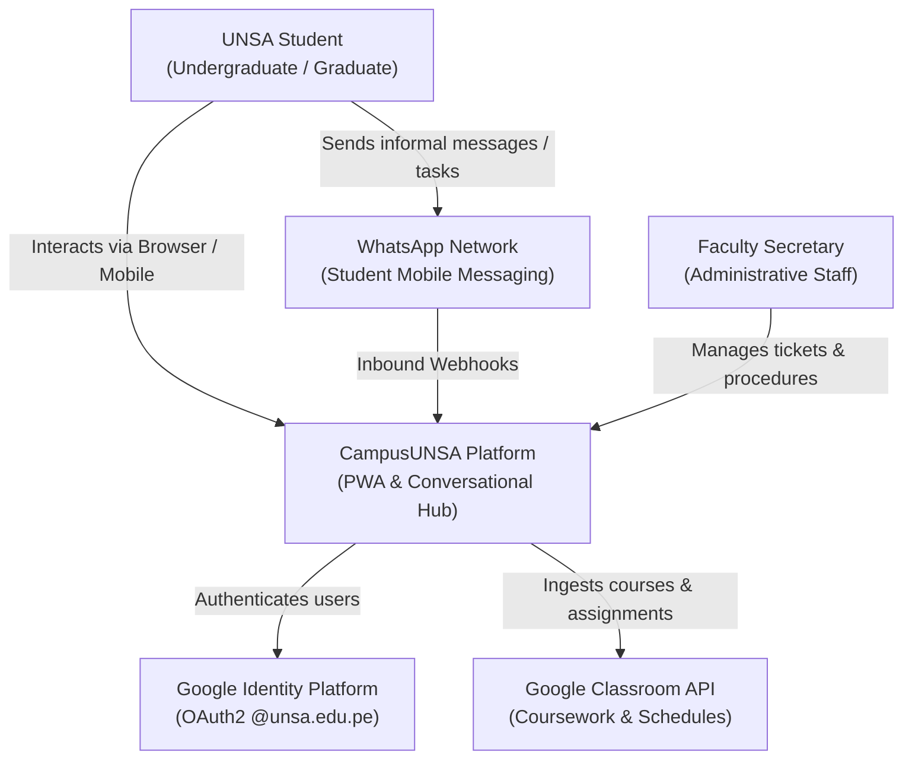
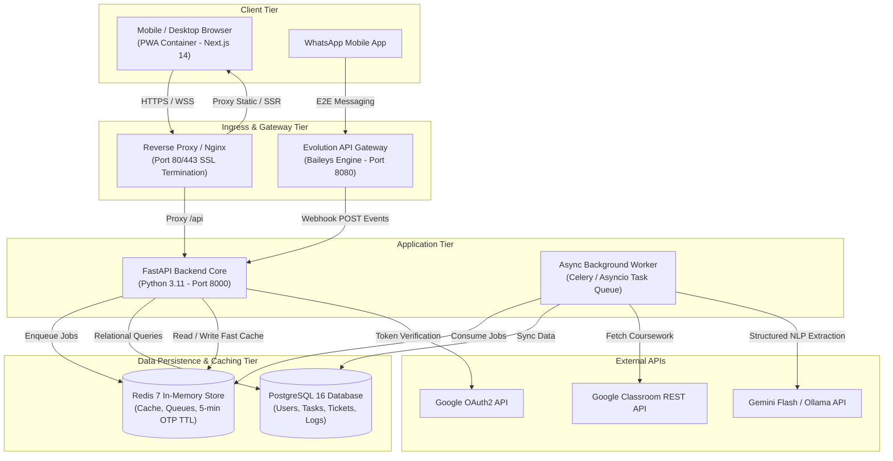
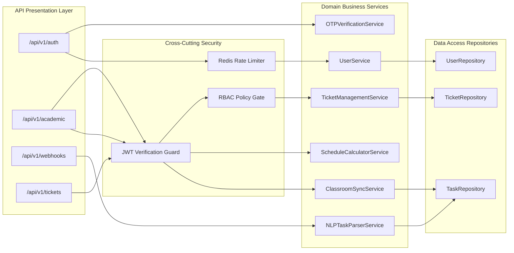
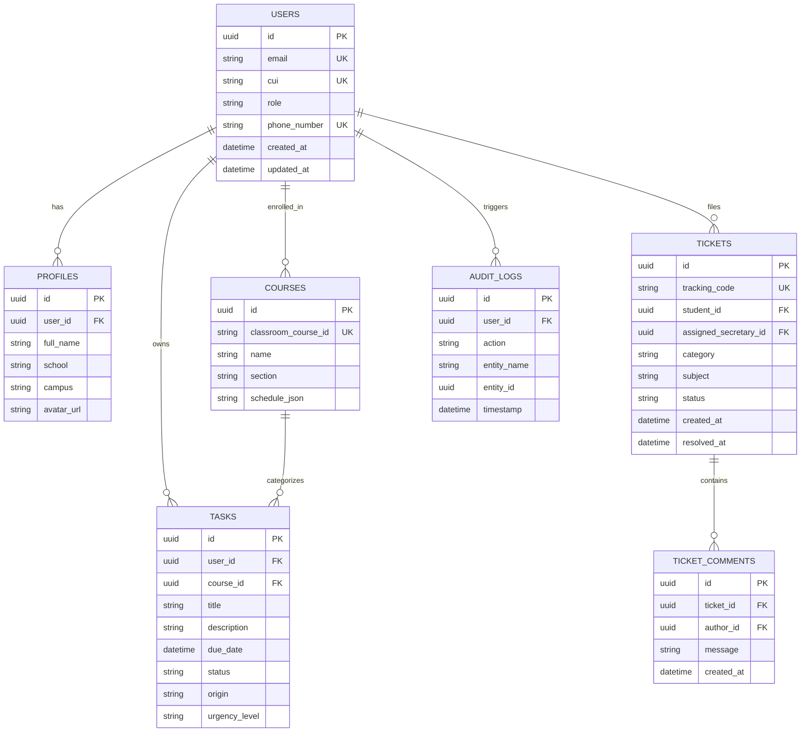

# CampusUNSA: System Architecture Document (SAD)

## Document Identifier: SAD-CAMPUSUNSA-2026-V1.0
### Scope: Release v1.0 Architectural Baseline
### Status: Approved Engineering Architecture

---

## 1. Architectural Overview & Design Principles

CampusUNSA implements an offline-resilient, modular monolithic service topology orchestrating student interaction across web and conversational channels. The architecture prioritizes data privacy, zero recurring cloud licensing costs, and sub-second responsiveness inside university grounds.

### Core Architectural Principles
1. **Offline-First PWA Resilience:** Student schedules, tasks, and campus information must load in < 500 ms even when mobile network connectivity fails inside thick pavilion walls.
2. **Zero-Cost Infrastructure Baseline:** Utilizes 100% open-source, containerized stacks (FastAPI, PostgreSQL, Redis, Evolution API) deployable on commodity university servers.
3. **Decoupled Domain Services:** Clean separation between authentication, Google Classroom ingestion, conversational parsing, and secretarial workflows.
4. **Verifiable Quality Gates:** Backend business rules backed by automated Pytest suites (target >= 80% coverage) and BDD acceptance criteria.

---

## 2. C4 Model - Level 1: System Context Diagram

The following diagram illustrates how students, secretarial staff, and external systems interact with the CampusUNSA platform:

---

## 3. C4 Model - Level 2: Container Architecture

The container topology decomposes the system into isolated Docker services communicating over private virtual bridge networks:

---

## 4. C4 Model - Level 3: FastAPI Component Architecture

Inside the FastAPI application core, modules operate under clean layered architecture:

---

## 5. Entity-Relationship Data Model (PostgreSQL 16)

---

## 6. Security & Authentication Architecture

1. **Institutional Domain Enforcement:**
   * Google OAuth2 verification verifies the `hd` (hosted domain) claim.
   * Hard rejection if `hd != "unsa.edu.pe"`.
2. **Cryptographic Token Lifecycle:**
   * Access tokens: Signed RS256/HS256 JWT with 60-minute expiration.
   * Refresh tokens: Secure HTTP-only cookies with SameSite strict protection.
3. **5-Minute OTP Verification:**
   * Phone binding generates 6-digit cryptographic numeric codes (`secrets.choice`).
   * Stored in Redis with `SETEX phone_otp:<cui> 300 <code_hash>`.
   * Max 3 verification attempts before key invalidation.
4. **Role-Based Access Control (RBAC):**
   * Predefined roles: `student`, `secretary`, `admin`.
   * Route decorators enforce least-privilege access at controller entrypoints.

---

## 7. Caching & PWA Offline Strategy

* **Browser Tier (PWA):**
  * `Service Worker` implements Workbox caching policies:
    * Static UI assets: `CacheFirst` with 30-day cache lifetime.
    * Academic schedules & active tasks: `StaleWhileRevalidate` with local `IndexedDB` mirror.
  * Allows instantaneous rendering (< 500 ms) in lecture halls lacking mobile reception.
* **Server Tier (Redis 7):**
  * Academic schedule cache key: `schedule:<cui>` with 15-minute TTL.
  * Webhook idempotency key: `webhook:event:<message_id>` with 24-hour TTL to prevent duplicate task creation.
