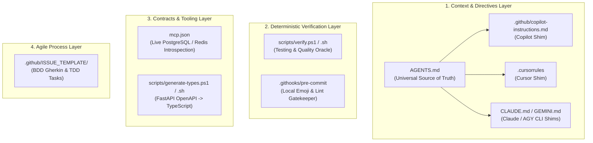

# Agentic AI Software Engineering Standard

## Document Identifier: STD-CAMPUSUNSA-AGENTIC-2026-V1.0
### Status: Draft for Review
### Project: CampusUNSA
### Audience: Engineering & Development Team (Marco, Ricardo, Sebastian, Italo)

---

## 1. Justification & Philosophy: Anti-Vibecoding

In modern software engineering, the term *vibecoding* refers to prompting language models in an unstructured manner, accepting generated suggestions without understanding foundational mechanics, lacking automated test validation, and neglecting architectural integrity.

This practice introduces latent vulnerabilities, silent technical debt, and contract mismatch across modules.

For CampusUNSA, the engineering team adopts an **Evidence-Based Agentic Engineering** methodology:
* **AI is a guided implementer, not the architect:** System design, interface contracts, and security boundaries are defined, understood, and audited by human engineers.
* **Deterministic verification oracles:** No code produced by an agent is accepted until it clears static linters, strict typing passes, and automated unit test suites.
* **Traceability and reproducibility:** All human developers and AI coding agents operating on this repository adhere strictly to identical workflows, branching rules, and project constraints.

---

## 2. Planned Repository Components

The table and topology below outline each proposed component, explaining **what it is**, **why it is required**, and **how it is implemented**:

---

### Component 1: Universal Instruction Directives (`AGENTS.md` + Tool Shims)

* **What it is:** A central markdown file in the repository root (`/AGENTS.md`), backed by shims (`.github/copilot-instructions.md`, `.cursorrules`, `CLAUDE.md`, `GEMINI.md`).
* **Why it is required:**
  1. Supplies immediate architectural context to any AI agent (FastAPI, Next.js 14, PostgreSQL 16, Redis 7, Evolution API).
  2. Defines standardized runtime commands, preventing agents from hallucinating destructive terminal commands.
  3. Enforces inviolable repository constraints: **zero emojis**, mandatory `@unsa.edu.pe` domain validation, and **exclusive use of English for all repository artifacts** regardless of chat prompt language.
  4. Enforces the Git delivery workflow (feature branches, Conventional Commits, peer review, and squash merges).
* **How it is implemented:** Comprehensive markdown document in the repository root referenced by all tool-specific configuration files.

---

### Component 2: Deterministic Verification Oracle (`scripts/verify.ps1` & `scripts/verify.sh`)

* **What it is:** A single-step executable script for Windows (PowerShell) and Linux/macOS/WSL (Bash).
* **Why it is required:**
  1. AI agents perform best when provided with an unambiguous, deterministic verification oracle.
  2. Prevents omissions (e.g., passing backend tests while forgetting frontend linting).
  3. Saves CI execution quotas by catching defects locally before code is pushed to GitHub.
* **How it is implemented:** Sequential execution of:
  * Modified file scan enforcing the zero-emoji policy.
  * Docker container health and responsiveness checks.
  * Backend linter: `ruff check app tests`.
  * Backend unit tests: `python -m pytest tests/ -v --cov=app --cov-report=term-missing`.
  * Frontend component tests: `npm run test` (Vitest).
  * Deterministic exit code: `0` on 100% success, non-zero on failure.

---

### Component 3: Model Context Protocol Configuration (`mcp.json`)

* **What it is:** A configuration file implementing the open Model Context Protocol (MCP).
* **Why it is required:**
  1. Enables AI agents to introspect live PostgreSQL database schemas (`localhost:5432`).
  2. Eliminates relational schema hallucinations (inventing non-existent columns, tables, or foreign keys).
  3. Allows agents to query actual database tables safely during local debugging sessions.
* **How it is implemented:** Standard MCP server definition connecting to local PostgreSQL and repository docs.

---

### Component 4: AI-Optimized GitHub Issue Templates (`.github/ISSUE_TEMPLATE/`)

* **What it is:** Structured GitHub issue forms for User Stories (`user_story_tdd.md`) and Bug Reports (`bug_report.md`).
* **Why it is required:**
  1. Vague issue descriptions lead agents to make arbitrary assumptions.
  2. Mandates formal acceptance criteria in Gherkin / BDD syntax (`Given-When-Then`).
  3. Enforces technical TDD phases (Red -> Green -> Refactor) and reviewer assignments.
* **How it is implemented:** GitHub issue forms with validated input schemas in `.github/ISSUE_TEMPLATE/`.

---

### Component 5: End-to-End API Contract Synchronization (`scripts/generate-types.*`)

* **What it is:** A script that inspects FastAPI's OpenAPI schema (`http://localhost:9000/openapi.json`) and exports TypeScript interfaces into `frontend/src/types/api.ts`.
* **Why it is required:**
  1. Eliminates API drift between backend Pydantic models and frontend React components.
  2. Provides immediate TypeScript autocompletion and compile-time type safety.
  3. Prevents agents from guessing payload signatures when integrating Next.js views with FastAPI endpoints.
* **How it is implemented:** OpenAPI schema fetch piped into `openapi-typescript` code generation.

---

### Component 6: Local Git Pre-Commit Hook (`.githooks/pre-commit`)

* **What it is:** A client-side hook executed automatically by Git before recording each commit (`git commit`).
* **Why it is required:**
  1. Acts as an automated gatekeeper preventing broken code or emojis from leaving the developer's workstation.
  2. Enforces formatting and lint rules locally, keeping CI pipelines green.
* **How it is implemented:** Shell script in `.githooks/` configured via `git config core.hooksPath .githooks`.

---

## 3. Step-by-Step Execution Roadmap

| Step | Milestone Artifacts | Deliverable Review |
| :---: | :--- | :--- |
| **Step 1** | `AGENTS.md` + Tool Shims (`CLAUDE.md`, `GEMINI.md`, `.cursorrules`, `copilot-instructions.md`) | Universal agent instructions, English-only policy, and zero-emoji enforcement. |
| **Step 2** | `scripts/verify.ps1` and `scripts/verify.sh` | Deterministic verification oracle executing linter, Pytest, Vitest, and emoji scans. |
| **Step 3** | `.github/ISSUE_TEMPLATE/` (User Story BDD & Bug Report) | Standardized issue templates with Gherkin scenarios and TDD task lists. |
| **Step 4** | `mcp.json` and `scripts/generate-types.*` | MCP database server definition and automated TypeScript type generator. |
| **Step 5** | `.githooks/pre-commit` | Client-side git pre-commit hook preventing emoji and lint regressions. |
| **Step 6** | Verification & Commit to `main` | Full suite execution and atomic commit to `main` before starting Sprint 2. |
