# CampusUNSA: Agile Sprint Plan & Workload Allocation Matrix

## Document Identifier: PLAN-CAMPUSUNSA-2026-V1.0
### Execution Cadence: 9 One-Week Sprints (October 07, 2026 - December 09, 2026)
### Review Milestones: Every Wednesday at 18:00 UTC-5
### Interactive Board: [GitHub Projects Board #5](https://github.com/users/MarcoXMarquez/projects/5)

---

## 1. Team Capacity & Pair Programming Allocation

The engineering workload is balanced across all four developers utilizing a primary (Lead Developer) and secondary (Peer Reviewer / QA) model:

| Developer | GitHub Handle | Primary Focus Areas | Assigned Stories | Workload Share |
| :--- | :--- | :--- | :---: | :---: |
| **Marco Antonio Marquez Herrera** | `@MarcoXMarquez` | Architecture, Google OAuth, Classroom API, Secretarial Handoff, Release | 8 Stories | 25% |
| **Ricardo Mauricio Chambilla Perca** | `@rikich3` | Domain Services, NLP LLM Parser, 5-min OTP, RAG Engine, QA Lead | 8 Stories | 25% |
| **Alejandro Sebastian Alfonso Huacasi** | `@Sebastianzzzin` | Frontend Web, Task Board UI, PWA Offline, Docker Compose, Load Tests | 8 Stories | 25% |
| **Italo Frankdux Ccoscco Alvis** | `@iccoscco` | UI/UX, Procedure Flowcharts, Ticketing Console, Auth Integration | 7 Stories | 25% |

---

## 2. Product Backlog & Sprint Distribution (Issues #1 to #21)

```mermaid
flowchart LR
    subgraph Foundation["S1: Foundation"]
        I1["#1: Docker & CI"]
    end

    subgraph Identity["S2: Auth & RBAC"]
        I2["#2: Google OAuth"]
        I3["#3: RBAC Security"]
    end

    subgraph Academic["S3-S4: Academic Hub"]
        I4["#4: Classroom Sync"]
        I5["#5: Task Board UI"]
        I6["#6: Schedule & Next Class"]
        I7["#7: PWA Offline Mode"]
    end

    subgraph Messaging["S5-S6: WhatsApp & NLP"]
        I8["#8: OTP Phone Binding"]
        I9["#9: Evolution Webhook"]
        I10["#10: NLP LLM Parser"]
        I11["#11: Board Scheduling"]
    end

    subgraph Guidance["S7: Guidance Desk"]
        I12["#12: Procedures Guide"]
        I13["#13: Secretarial Tickets"]
    end

    subgraph Hardening["S8-S9: Extensions & Release"]
        I14["#14: Document RAG"]
        I15["#15: Load Testing"]
        I16["#16: Pilot & Release v1.0"]
    end

    Foundation --> Identity --> Academic --> Messaging --> Guidance --> Hardening
```

### Complete Backlog Matrix

| Issue # | Story Code | Issue Title | Sprint | Review Date | Lead Developer | Peer Reviewer | MoSCoW Priority |
| :---: | :---: | :--- | :---: | :---: | :--- | :--- | :---: |
| **#1** | `US-01` | Fully Reproducible Containerized Development Environment | Sprint 1 | Wed Oct 14 | `@MarcoXMarquez` | `@rikich3` | Must Have |
| **#2** | `US-02` | Institutional Google OAuth Login & Profile Provisioning | Sprint 2 | Wed Oct 21 | `@MarcoXMarquez` | `@iccoscco` | Must Have |
| **#3** | `US-03` | Role-Based Access Control (RBAC) Security Middleware | Sprint 2 | Wed Oct 21 | `@rikich3` | `@Sebastianzzzin` | Must Have |
| **#4** | `US-04` | Google Classroom Course & Assignment Sync Engine | Sprint 3 | Wed Oct 28 | `@MarcoXMarquez` | `@Sebastianzzzin` | Must Have |
| **#5** | `US-05` | Visual Academic Task Board with Urgency Traffic Lights | Sprint 4 | Wed Nov 04 | `@Sebastianzzzin` | `@iccoscco` | Must Have |
| **#6** | `US-06` | Dynamic Weekly Class Schedule & Next Class Widget | Sprint 4 | Wed Nov 04 | `@rikich3` | `@MarcoXMarquez` | Must Have |
| **#7** | `US-07` | PWA Service Worker Caching & 100% Offline Mode | Sprint 4 | Wed Nov 04 | `@Sebastianzzzin` | `@iccoscco` | Must Have |
| **#8** | `US-08` | Secure 5-Minute OTP WhatsApp Phone Binding Lifecycle | Sprint 5 | Wed Nov 11 | `@rikich3` | `@MarcoXMarquez` | Must Have |
| **#9** | `US-09` | Evolution API Inbound Webhook Ingestion Gateway | Sprint 5 | Wed Nov 11 | `@Sebastianzzzin` | `@rikich3` | Must Have |
| **#10** | `US-10` | NLP Task Extraction via Structured LLM Parsing | Sprint 6 | Wed Nov 18 | `@rikich3` | `@MarcoXMarquez` | Must Have |
| **#11** | `US-11` | Automated Task Insertion with WhatsApp Confirmation | Sprint 6 | Wed Nov 18 | `@iccoscco` | `@Sebastianzzzin` | Must Have |
| **#12** | `US-12` | Interactive University Procedures and Bureaucracy Flowcharts | Sprint 7 | Wed Nov 25 | `@iccoscco` | `@Sebastianzzzin` | Must Have |
| **#13** | `US-13` | Human Secretarial Escalation & Ticket Management Console | Sprint 7 | Wed Nov 25 | `@MarcoXMarquez` | `@iccoscco` | Must Have |
| **#14** | `US-14` | Official Regulations Knowledge Base & RAG Query Engine | Sprint 8 | Wed Dec 02 | `@rikich3` | `@MarcoXMarquez` | Should Have |
| **#15** | `US-15` | Automated Load and Stress Verification (1,000 Users) | Sprint 8 | Wed Dec 02 | `@Sebastianzzzin` | `@iccoscco` | Should Have |
| **#16** | `US-16` | System Hardening, 30-Student Live Pilot & Release v1.0 | Sprint 9 | Wed Dec 09 | `@MarcoXMarquez` | All Team Members | Must Have |
| **#17** | `Candidate` | Campus GIS Navigation & Classroom Locator | Sprint 8 | Wed Dec 02 | `@Sebastianzzzin` | `@iccoscco` | Should Have |
| **#18** | `Candidate` | Community Lost & Found Hub with Verified Claims | Sprint 8 | Wed Dec 02 | `@rikich3` | `@iccoscco` | Should Have |
| **#19** | `Candidate` | Study Session Pomodoro Focus Timer & iCal Export | Sprint 8 | Wed Dec 02 | `@MarcoXMarquez` | `@Sebastianzzzin` | Should Have |
| **#20** | `Future` | Digital Student ID Barcode & Turnstile Integration | Posterior | Post-v1.0 | `@MarcoXMarquez` | `@rikich3` | Won't Have |
| **#21** | `Future` | Dining Hall Occupancy Geofencing & SISUNSA Scraping | Posterior | Post-v1.0 | `@Sebastianzzzin` | `@iccoscco` | Won't Have |

---

## 3. Definition of Ready (DoR) & Definition of Done (DoD)

### Definition of Ready (DoR)
A User Story is ready for developer kickoff only when:
1. Business value and user persona are defined (`As a... I want... So that...`).
2. Acceptance criteria are fully written in Gherkin syntax (`Given-When-Then`).
3. External API dependencies and contracts are mapped.
4. Primary and secondary engineers are assigned.

### Definition of Done (DoD)
A User Story is completed only when:
1. Automated unit or integration tests are written and passing in local and CI environments.
2. Target test coverage (>= 80% on domain services) is maintained.
3. Code complies with style guidelines with zero linter errors (`ruff`, `eslint`).
4. Pull Request has been reviewed and approved by the peer reviewer.
5. All acceptance criteria scenarios have been demonstrated in the staging environment.

---

## 4. GitHub Projects Board Architecture

The project board maintains five customized views to provide stakeholders with clear progress visibility:
1. **Active Sprint (Kanban):** Columns: `Backlog`, `Ready`, `In progress`, `In review`, `Done`. Filter: active iteration.
2. **Product Backlog & Sprints (Table):** Grouped by `Sprint`. Filter: `-priority:"Won't Have"`.
3. **Roadmap Timeline:** Visualizes 9-week progression from October 07 to December 09.
4. **Workload by Developer:** Grouped by `Assignees` to audit team distribution.
5. **Future Scope (v2.0 Backlog):** Filter: `priority:"Won't Have"` to isolate deferred requirements (#20 and #21).
